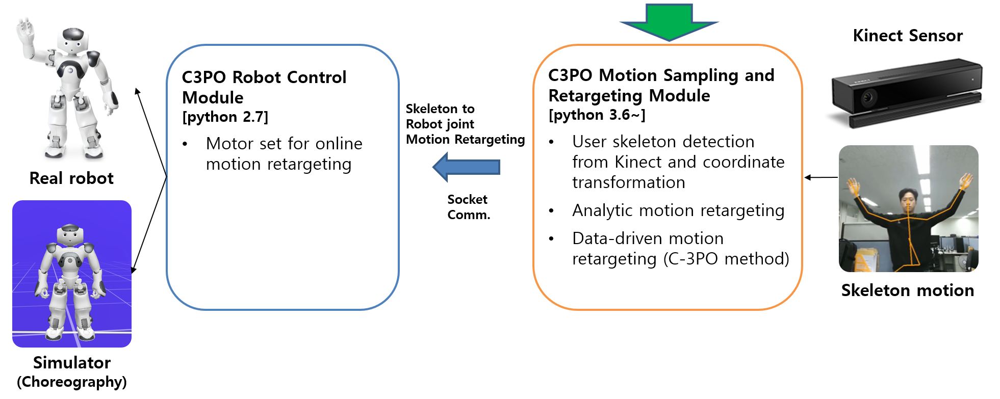

 ## [Motion Retargeting Module] C-3PO Motion Retargeting
This project is a motion retargeting module for human-robot motion retargeting. Human motion 
is captured and converted to a skeleton motion by Kinect sensor, where the skeleton consists of 
25 joints as shown in [this](https://arxiv.org/pdf/1604.02808.pdf). The skeleton motions are then retargeted to 
robot motions frame by frame by our algorithm. 

Motion retargeting module provides two methods for motion retargeting, 
where the first one is an analytic approach ([paper](https://ieeexplore.ieee.org/stamp/stamp.jsp?tp=&arnumber=7886806)) 
and the second is our C-3PO method which is based on data-driven and reinforcement learning. 
Following figure represents the overall structure of our C-3PO motion retargeting system. 



### Update
```buildoutcfg
* Training module will be updated soon
```

### Getting Started
<pre>
Before you start, please download <a href="https://drive.google.com/file/d/1W6I5uVB8DalksqW26B9LJ0GBKLzwBONQ/view?usp=sharing">"trained_models.zip"</a> 
and extract the file here without any modifications of the file name.  

1) Set the appropriate port numbers and run the "demo.py" file of the robot control module.
2) Set the identical port number to the robot control module.
3) After initialize the arguments and user parameters, run the "pykinect_stream.py" file and enjoy.

You can choose motion retargeting mode(Analytic, C3PO), robots(NAO, Baxter, C-3PO) 
and simulation environment(Choregraphy, V-REP) using the user parameters described at the top of the 
"pykinect_stream.py".   
</pre>

### File descriptions
```buildoutcfg
    .
    ├── data                                    # Temporary files for training
    │   ├── aug_motion                           
    │   ├── skeleton
    │   └── synthetic_motion
    ├── figs                                     
    │   └── system.png                          # Figure for README file
    ├── robots
    │   |── vrep
    |   |   |── baxter_mimic.ttt                # V-REP project file for BAXTER robot
    |   |   |── c3po_mimic.ttt                  # V-REP project file for C-3PO robot
    |   |   └── nao_mimic.ttt                   # V-REP project file for NAO robot
    │   ├── BAXTER_MIMIC.py                     # BAXTER robot class for simulation based training  
    │   ├── C3PO_MIMIC.py                       # C3PO robot class for simulation based training
    │   └── NAO_MIMIC.py                        # NAO robot class for simulation based training
    ├── trained_models                          # !!! This folder should be downloaded at first !!! 
    │   |── ppo                                 
    |   |   |── phase1                          # Augmented robot motion trajectory dataset
    |   |   |── phase2                          # Trained policy using PPO algorithm
    |   |   └── phase3                          # Fine-tuned policy in phase 3
    │   |── vae
    |   |   |── [Baxter]Motion_vae_Superset.pt  # BAXTER robot motion encoder-decoder network
    |   |   |── [C3PO]Motion_vae_Superset.pt    # C3PO robot motion encoder-decoder network
    |   |   |── [NAO]Motion_vae_Superset.pt     # NAO robot motion encoder-decoder network
    |   |   └── Skel_vae_Superset.pt            # Human skeleton encoder-decoder network
    ├── arguments.py                            # Arguments for learning
    ├── CommonObject.py                         # Commonly used functions and variables
    ├── distributions.py                        # Network class for action sampling
    ├── ExpCollector.py                         # Class for V-REP environment 
    ├── model.py                                # Policy network model definition
    ├── motion_encoding.py                      # Learning robot motion encoder-decoder network
    ├── MR_Demo.py                              # Demo file for motion retargeting
    ├── NAO_AMR.py                              # Analytic motion retargeting class only for NAO
    ├── NAO_analytic_motion_retargeting_test.py # NAO Analytic motion retargeting test code
    ├── pykinect_stream.py                      # Kinect based motion sampling and retargeting demo
    ├── README.md
    ├── remoteApi.dll                           # Library file for V-REP
    ├── requirements.txt
    ├── Skeleton.py                             # Class for Skeleton management 
    ├── skeleton_encoding.py                    # Learning skeleton encoder-decoder network 
    ├── SkeletonDataManager.py                  # Skeleton data management
    ├── storage.py                              # Class for storage and management of rollout data 
    ├── test_skeleton_pose.txt                  # Skeleton frame for test
    ├── utils.py                                # Utility for policy network
    ├── vae_model.py                            # Variational AutoEncoder model
    ├── vecEnv.py                               # Vectorized Environment
    ├── VecNormalize.py                         # Vectorized Environment
    ├── vrep.py                                 # File for V-REP use 
    └── vrepConst.py                            # File for V-REP use

[Important!!]
* In order to use the V-REP simulator in PyCharm, you should copy three files of "remoteApi.dll", 
"vrep.py" and "vrepConst.py" into the main project folder. 
* ASUS mother board does not support the Kinect V2.
```

### External Dependencies 
<pre>
* Python 3.7 ~
* <a href="https://www.coppeliarobotics.com/">CoppeliaSim(V-REP)</a>
* <a href="https://www.microsoft.com/en-us/download/details.aspx?id=44559">Kinect Windows Driver</a>
</pre>

### Requirements
```buildoutcfg
pip install -r requirements.txt
```

### Publication
Please refer to the following paper and video for more detailed information.
* Kim and Lee, C-3PO: Cyclic-Three-Phase Optimization for Human-Robot Motion Retargeting based on 
Reinforcement Learning, ICRA 2020, 
[[Paper]](https://arxiv.org/abs/1909.11303), 
[[YouTube]](https://www.youtube.com/watch?v=C37Fip1X0Y0&t=19s)

```buildoutcfg
@article{kim2019c,
  title={C-3PO: Cyclic-Three-Phase Optimization for Human-Robot Motion Retargeting based on Reinforcement Learning},
  author={Kim, Taewoo and Lee, Joo-Haeng},
  journal={arXiv preprint arXiv:1909.11303},
  year={2019}
}
```

### Acknowledgment 
This work was supported by the ICT R&D program of MSIP/IITP [2017-0-00162, Development of Human-care 
Robot Technology for Aging Society].